# Mini Project — Azure Stream Analytics: Real-time Sales Processing

**Resumen**  
Proyecto sencillo de procesamiento en tiempo casi real con Azure Stream Analytics. Lee ficheros CSV de ventas desde un *Blob Storage* (`mp_container`), ejecuta una query de agregación en un *Stream Analytics Job* y escribe los resultados agregados en otro *Blob Storage* (`mp_output`). Incluye capturas de evidencia para portfolio.

---

## 1. Información general del proyecto

- **Nombre del proyecto:** `mp-sales-streamjob`
- **Objetivo:** demostrar ingestión de datos desde Blob → procesamiento con Stream Analytics → salida a Blob (agregados por categoría / ventana temporal).  
- **Servicios Azure usados:** Storage Account (Blob Containers), Stream Analytics Job.  
- **Fichero de entrada (ej.):** `mp_sales.csv` / `run1_mp_sales.csv`  
- **Formato:** CSV con encabezado. Ejemplo de esquema mínimo:

```csv
OrderId,OrderDate,ProductId,Category,Quantity,UnitPrice
1001,2025-12-01,SKU123,Electronics,2,199.99
1002,2025-12-01,SKU456,Home,1,45.50
```

---

## 2. Reproducción — pasos completos

### Paso 0 — Recursos previos
- Storage Account: `mpdatastorage123` 
- Container de input: `mp_container` (con `mp_sales.csv`).  
- Container de output: `mp_output` -> vacío al inicio.

Capturas:
-   
- 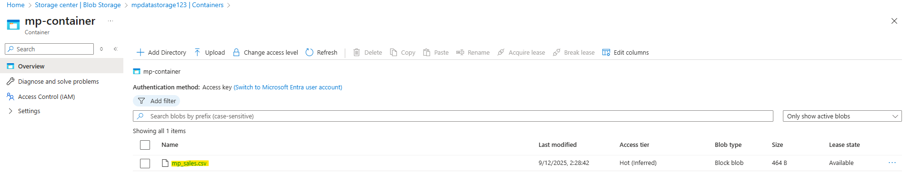  
- 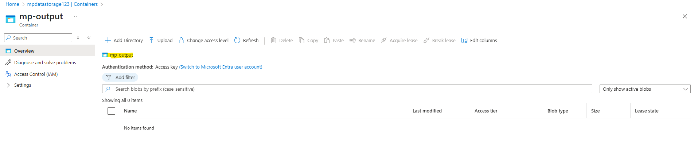

---

### Paso 1 — Crear el Stream Analytics Job
Azure Portal → *Stream Analytics jobs* → **Create**  
- Job name: `mp-sales-streamjob`  
- Resource group: tu RG  
- Location: West Europe 
- Streaming units: `1`

Capturas:
- 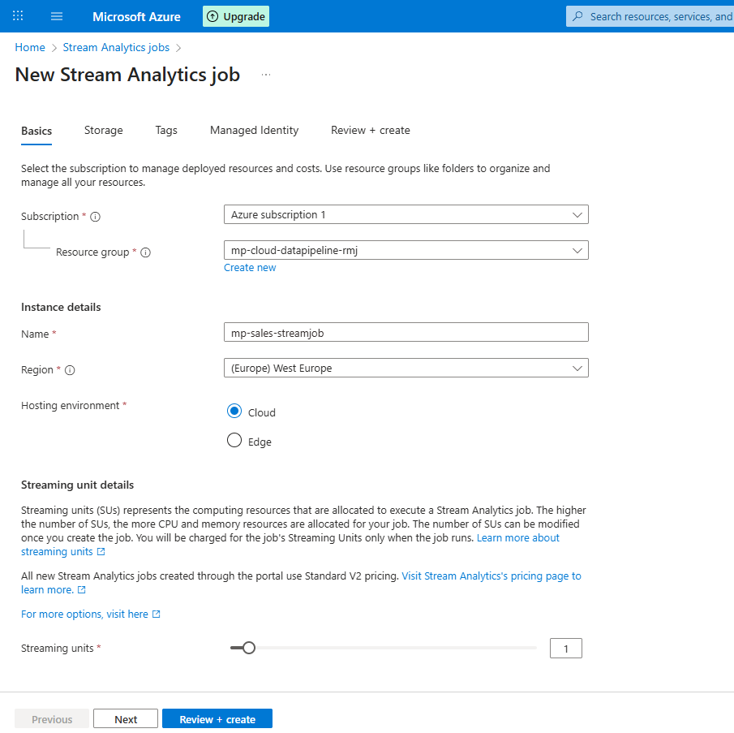 
- 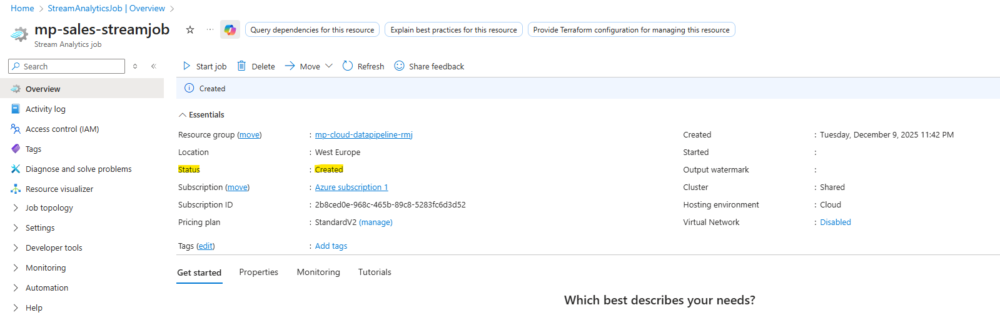

---

### Paso 2 — Configurar Input (Blob Storage)
Job → **Inputs → Add stream input → Blob storage**

- **Name:** `inputblobsales`  
- **Storage account:** `mpdatastorage123`  
- **Container:** `mp_container`  
- **Path pattern:** `cluster1/`
- **Event serialization:** CSV  
  - First row contains column names: **Yes**  
  - Field delimiter: `,`  
- **Timestamp extraction:** `OrderDate` (si contiene hora) o usar `EnqueueTime()` en la query

Capturas:
- 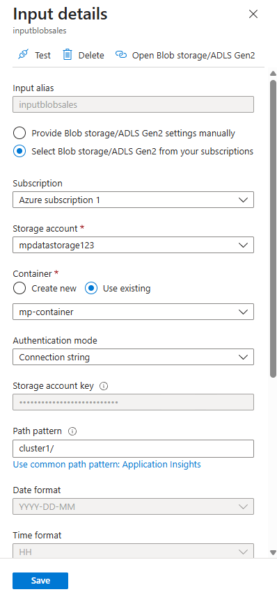  
- 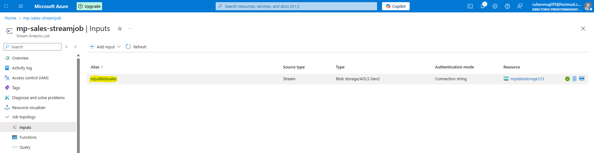

> **Nota práctica:** Stream Analytics procesa **solo** blobs subidos **después** de que el job esté en `Running`. 

---

### Paso 3 — Configurar Output (Blob Storage)
Job → **Outputs → Add → Blob storage**

- **Name:** `outputblobaggregates`  
- **Storage account:** `mpdatastorage123`  
- **Container:** `mp_output`  
- **Blob path / File name pattern:** `{date}/{time}/results` 
- **Event serialization:** CSV (Include header = Yes)  
- **Write mode:** `Append as results arrive`

Capturas:
- 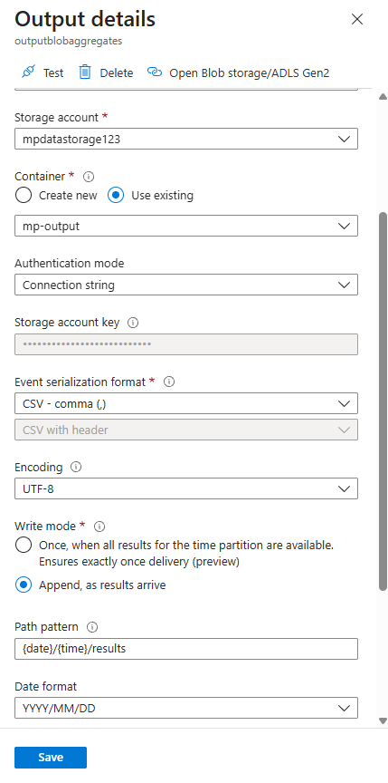  
- 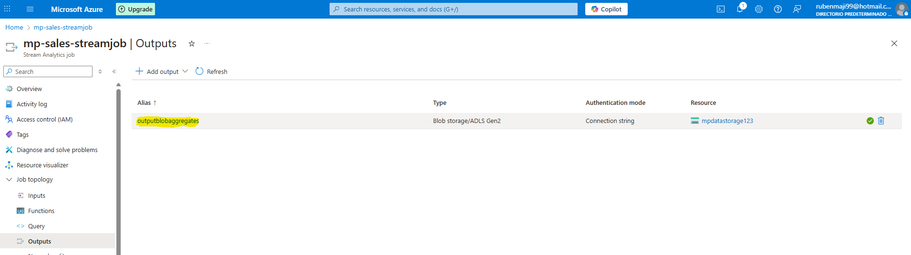

---

### Paso 4 — Crear la query de Stream Analytics
Pestaña **Query** del job — pegar y guardar la query:

```sql
-- Agrupación por categoría cada 1 minuto (tumbling window)
SELECT
    System.Timestamp() AS WindowEnd,
    Category,
    SUM(CAST(Quantity AS bigint) * CAST(UnitPrice AS float)) AS TotalSales,
    COUNT(*) AS Orders
INTO
    outputblobaggregates
FROM
    inputblobsales
GROUP BY
    TumblingWindow(minute, 1), Category;
```

Capturas:
-   
- 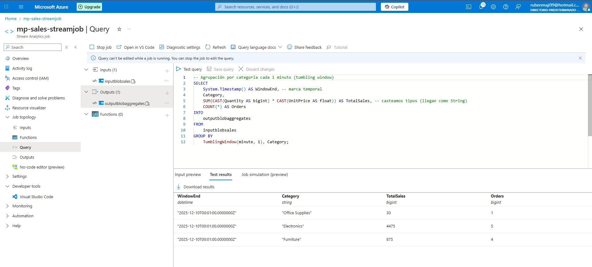

---

### Paso 5 — Ejecutar el job y probar el flujo
1. Overview → **Start** (Start now o con end time corto). Job pasa a **Running**.  
   - Captura: 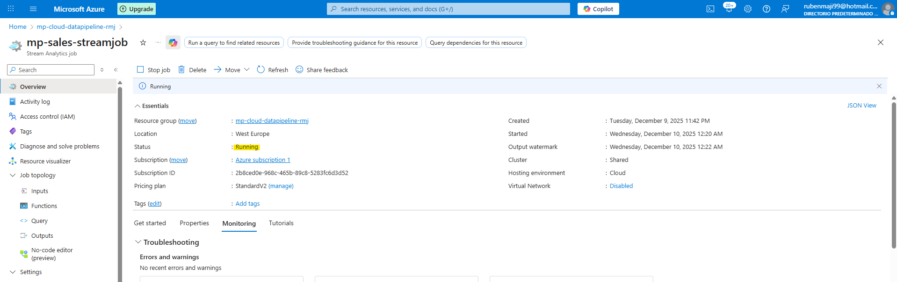

2. SUBIR un archivo nuevo al container de input **tras** haber arrancado el job.  
   - Ejemplo de nombre: `run1_mp_sales.csv`  
   - Captura: 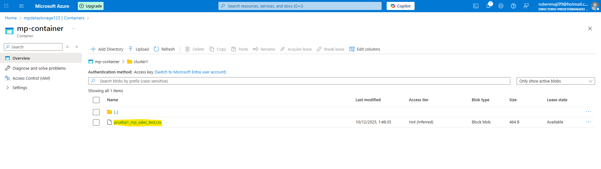

3. Esperar unos segundos y comprobar `mp_output/results/` → debería aparecer un fichero CSV con la agregación.  
   - Captura final: 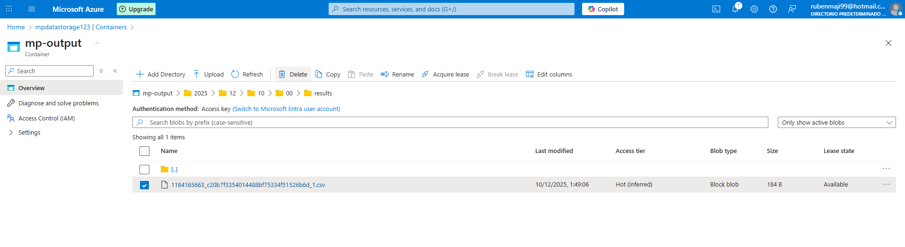

---

## 3. Resultados esperados (ejemplo)
Archivo generado en `mp_output/{date}/{time}/results` con columnas:

```
WindowEnd,Category,TotalSales,Orders
2025-12-10T15:01:00Z,Electronics,399.98,2
2025-12-10T15:01:00Z,Home,45.50,1
```

Métricas del job: **Input events > 0**, **Output events > 0**, job status = `Running`.

---

Caputura adicional para mostrar las Key Metrics:
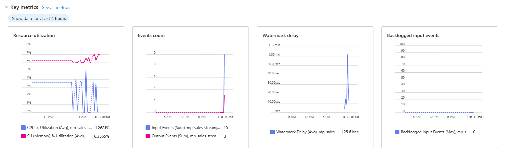

